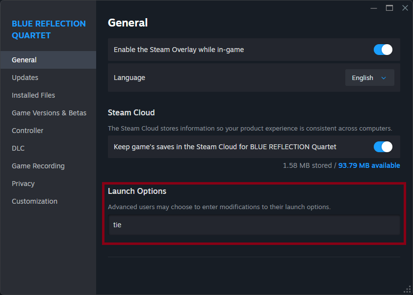

# br-quartet-launcher
A lightweight, custom C++ written launcher for **BLUE REFLECTION Quartet** designed to prevent startup crashes caused by **RTSS** (Rivatuner Statistics Server) or similar overlay tools during game initialization.

## What It Does
* Game DLL loading: Dynamically loads the specific game modules (`B0.dll` through `B4.dll`) depending on the selected arguments.

* RTSS compatibility: Bypasses initialization crashes associated with RivaTuner and similar overlays by managing window creation, game exported procedure callbacks and process lifecycle.

* Game swap: Handles internal return codes (`RETURN TO TOP` and `EXIT GAME`).

## How to Install and Use
1. Backup the Original Executable:
   - Go to your game installation directory (e.g., `E:\Games\Steam\steamapps\common\BLUE REFLECTION Quartet`).
   - Locate the original game executable (`BLUE REFLECTION Quartet.exe`).
   - Rename it to any other name (for example, `BLUE REFLECTION Quartet.bak.exe`) to keep it safely as a backup.

2. Install the launcher:
   - Place the `BLUE REFLECTION Quartet.exe` (this custom launcher) directly into the game's root directory where the original `.exe` used to be.

3. Run!
   - Launching the game normally through Steam will now execute this custom wrapper, opening the default menu (`quartet / B0.dll`).

## Steam Launch Options
If you want to boot straight into a specific game in the collection without having to navigate through the main launcher menu, you can configure the launch options in Steam.

1. Open **Steam** and go to your **Library**.
2. Right-click **BLUE REFLECTION Quartet** and select Properties....
3. Under the General tab, look for the **Launch Options** text box.
4. Type your target game into the field (e.g., `tie` as shown below).

  

## Available Arguments:
* `quartet` (Default) — Loads the main collection launcher (`B0.dll`).
* `br` — Loads BLUE REFLECTION (`B1.dll`).
* `ray` — Loads BLUE REFLECTION: Ray (`B2.dll`).
* `sun` — Loads BLUE REFLECTION: Sun (`B3.dll`).
* `tie` — Loads BLUE REFLECTION: Second Light (`B4.dll`).
